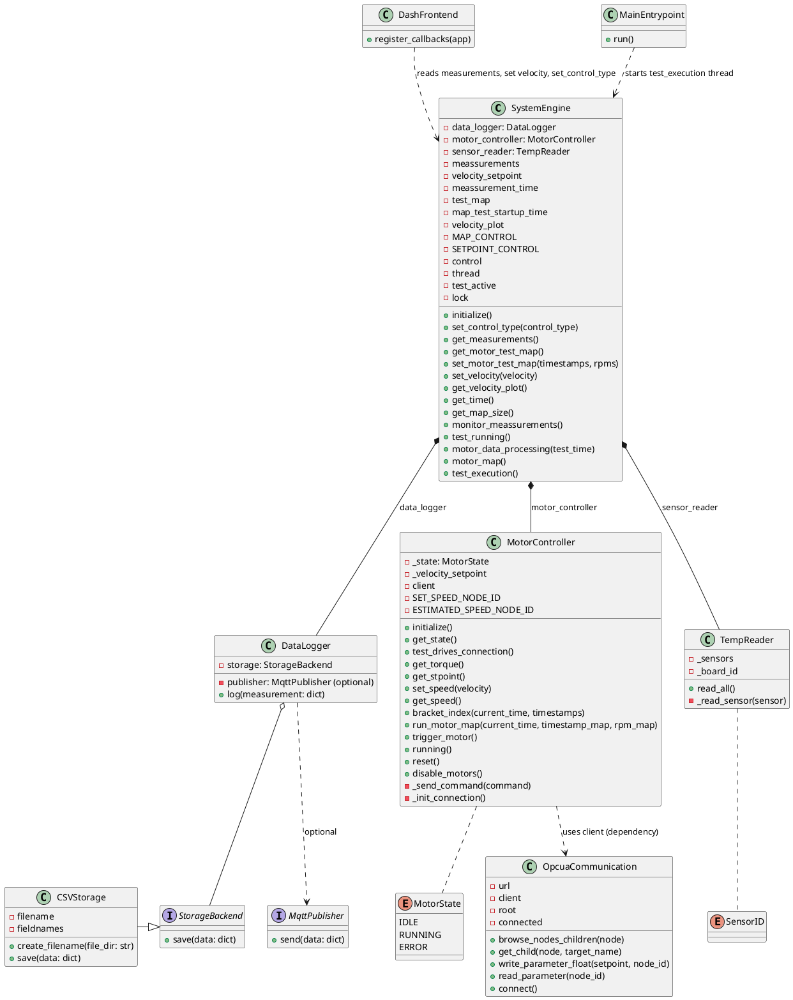
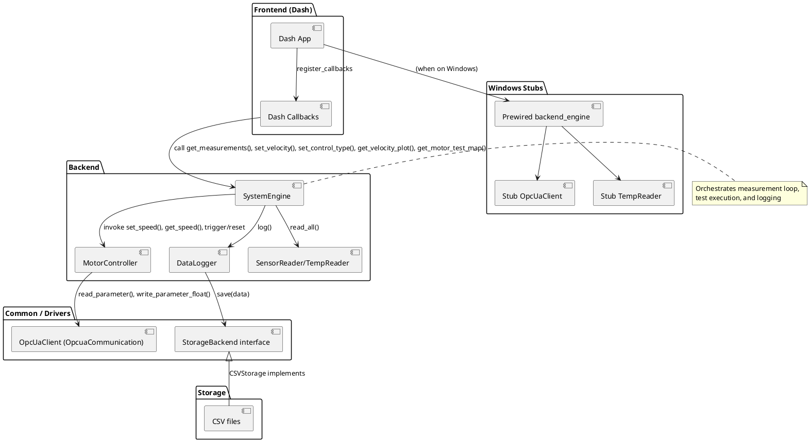

**Project Overview**

This document describes the drives_testing_framework repository. All content is derived from the repository codebase; items marked "(Assumed)" or "(Inferred)" indicate where implementation details were not explicit in the source and were reasonably inferred.

**Purpose of the system**:
- **Primary goal**: Provide a framework to run motor/drive tests, collect sensor data (temperature sensors), log results locally (CSV) and optionally publish via MQTT, while providing a web UI (Dash) for control and visualization.

**Main features**:
- Control motor runs by setpoint or by a time->rpm map.
- Collect temperature sensor readings and persist them to CSV files via a pluggable StorageBackend.
- OPC UA integration (via `common.opcua_communication.OpcuaCommunication`) to read/write drive parameters.
- Web UI built with Dash; multiple tabs provide test configuration, plots and controls. Windows-specific stubs provide mocked behavior for local development.

**High-level architecture**:
- Backend core: `backend.system_engine.SystemEngine` orchestrates tests, requests sensor readings from `TempReader`, and commands the `MotorController`. It delegates logging to `DataLogger`.
- Logging: `DataLogger` composes a `StorageBackend` (implemented by `CSVStorage`) and may optionally use an MQTT publisher interface.
- Motor I/O: `MotorController` interacts with an OPC UA client (type `OpcuaCommunication`) to write setpoints and read estimated speed.
- Frontend: Dash layout and callbacks in `frontend/` query `backend_engine` to drive UI and control.
- Windows stubs: `windows_stubs/` provides stubbed `OpcuaCommunication`, `TempReader` and a prewired `backend_engine` for development on Windows.

**Repository notes / inconsistencies (observed)**
- `main.py` imports `backend_runner` from `backend.backend` but the actual module defines `backend_engine` (in `backend/backend.py`). This is an inconsistency in the repository (marked Inferred). The working entrypoint for Windows is `main_stub.py`, which imports `backend_engine` from `windows_stubs.backend`.
- `backend/mqtt_publisher.py` exists but is empty; `DataLogger` defines an abstract `MqttPublisher` interface, but no concrete publisher is provided in the repo.

**PlantUML: Class Diagram**
The following PlantUML depicts the main classes, attributes and methods found in the codebase.

Class Diagram explanation
- SystemEngine composes (strong ownership) the core runtime objects: `DataLogger`, `MotorController` and a `TempReader` (composition indicated by filled diamond). SystemEngine orchestrates the test lifecycle using these components.
- `DataLogger` depends on an abstract `StorageBackend` interface. `CSVStorage` is the concrete implementation present in the repository. This is an example of the Strategy pattern (pluggable storage strategy): `DataLogger` delegates storage to objects implementing `StorageBackend`.
- `DataLogger` optionally calls a `MqttPublisher` interface if present (loose dependency). The repo declares the abstract interface but provides no concrete publisher implementation.
- `MotorController` holds a `client` reference (expected to be an OPC UA client wrapper `OpcuaCommunication`), so it depends on the communication module for reading/writing parameters; this is a dependency/injection relationship. The code in `windows_stubs/backend.py` constructs `MotorController(opcua_client)` showing how the client is supplied.
- `TempReader` provides temperature measurements; in `windows_stubs` there is a stub `TempReader` that returns random values for Windows development.

Design patterns (observed/inferred)
- Strategy: `StorageBackend`/`CSVStorage` used by `DataLogger` (pluggable storage backends).
- Dependency injection (lightweight): `MotorController` accepts a `client` parameter in its constructor (used in `windows_stubs.backend`), enabling substitution of real OPC UA client vs a stub.
- Observer-like callback model (frontend): Dash callbacks register to periodically read data from `backend_engine` and update UI. While not a classical Observer pattern implementation, the UI acts as a consumer of state provided by `SystemEngine`.

Assumptions / Inferred items (explicit)
- `MotorController` expects an object with `connect()`, `read_parameter()` and `write_parameter_float()` methods — this is implemented by `common.opcua_communication.OpcuaCommunication` and by `windows_stubs.opcua_communication.OpcuaCommunication`.
- The existence of `backend_engine` vs `backend_runner` is inconsistent in `main.py`. The doc uses `backend_engine` as the actual variable present in the repository (found in `backend/backend.py` and `windows_stubs/backend.py`).

---

**PlantUML: Component Diagram**
The following PlantUML shows components (modules) and how they interact at a higher level.

Component diagram explanation
- Frontend: The Dash app (layout + callbacks) is a UI layer that queries and exercises the `SystemEngine` through a process-global `backend_engine` object. Dash callbacks are scheduled by Dash's architecture and call into `SystemEngine` to read state and to trigger control actions.
- Backend: `SystemEngine` is the central coordinator; it controls `MotorController` and polls `TempReader`, sending measurements to `DataLogger`.
- Common / Drivers: The OPC UA client (`OpcuaCommunication`) is a driver-level component used by `MotorController` to talk to the physical drives. Storage backends are abstracted behind `StorageBackend`.
- Windows Stubs: For convenience and local development, `windows_stubs/` provides prewired versions of `OpcuaCommunication`, `TempReader`, and a `backend_engine` instance that uses those stubs so the UI and backend can run without real hardware.

Design patterns in components
- Adapter / Façade (inferred): `OpcuaCommunication` wraps the lower-level OPC UA client (`opcua.Client`) and provides simpler read/write helper methods, acting like a small façade.
- Strategy: storage backend abstraction (see class diagram).

---

Per-module summary (quick reference)
- `backend/system_engine.py` — System orchestration, test loop (`test_execution`), data processing and motor map logic.
- `backend/motor_controller.py` — Motor control abstraction, expects a `client` to perform OPC UA read/write. Also contains `bracket_index` and `run_motor_map` logic.
- `backend/sensor_reader.py` — `TempReader` reading real hardware via `librtd` (production) — returns a dict keyed by `SensorID`.
- `backend/data_logger.py` — Storage abstraction, `CSVStorage` concrete implementation. `DataLogger.log()` adds timestamp and delegates to storage/publisher.
- `common/opcua_communication.py` — OPC UA helper/wrapper around `opcua.Client` with `read_parameter()` and `write_parameter_float()` methods.
- `frontend/` — Dash layout and many callback modules. Callbacks read backend state from `backend_engine` (the repo provides `windows_stubs/backend.py` and `backend/backend.py` which define `backend_engine`).
- `windows_stubs/` — Development stubs (mock sensor reader, stubbed OPC UA client and prewired `backend_engine`). Useful when real hardware is not available.

---

Usage notes and next steps (suggestions)
- Rendering the PlantUML: paste the PlantUML blocks into a PlantUML renderer (e.g., the PlantUML VSCode extension) to visualize the diagrams.
- To run locally on Windows: `python main_stub.py` (this file imports `windows_stubs.backend` which constructs a `backend_engine` with stubbed components).
- To enable MQTT publishing: implement a concrete `MqttPublisher` in `backend/mqtt_publisher.py` and pass it into `DataLogger` construction.

If you want, I can:
- generate SVG/PNG images from the PlantUML blocks (requires a PlantUML runner), or
- refine diagrams to include more low-level functions or sequence diagrams for the test execution flow.

Assumptions reiterated
- All class/method/attribute names used in diagrams are pulled directly from the repository files at time of analysis. Any runtime wiring (for example which modules import which `backend_engine`) is taken from the actual files, and mismatches are highlighted above.

End of documentation.
